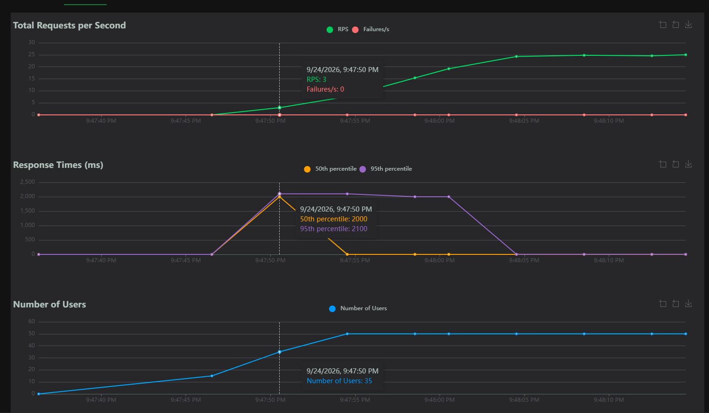
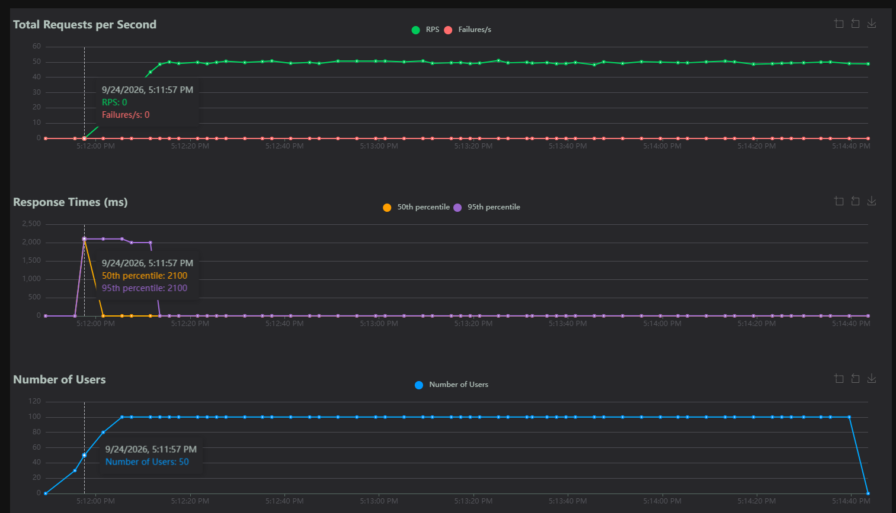

# Module 1

## 4.3
**1. 3.3.**
**2. 50.**
**3. p99 .**
**4. Отсуствуют.**

## 4.4
Все эндпоинты одинаково деградируют, различий нет

# 5
## 1.
## Реализация
| Метод | Эндпоинт | Значение |
|---|---|---|
| GET | / | Возвращает информацию о сервисе, его статус и текущее время |
| GET | /health | Проверяет доступность и состояние сервиса |
| GET | /products | Возвращает список доступных товаров |
| GET | /products/{product_id} | Возвращает информацию о конкретном товаре по его ID |

## Технологии

--

## 2 & 3.

| Тест |  Users | Spawn Rate | RPS | p50 | p95 | p99 | Error rate | lat. | Duration |
|---|---|---|---|---|---|---|---|---|---|
| A | 10 | 1 | 4.5 | 2 | 2000 | 2000 | 0 | 9 | 15
| B | 50 | 5 | 24.7 | 2 | 2 | 3 | 0 | 26 | 15 |
| C | 100| 10 | 35.8 | 2 | 2000 | 2100 | 0 | 450 | 20 |

# 4

## A
.png "A")

## B

## C

# 5

## Тест А

Пропускная способность увеличивается примерно до 4.5.
В момент активного роста p50 и p95 достинают (2000-2100) мс, стабилизируется после 9.
Ошибки отсутствуют.

## Тест B

Пропускная способность увеличивается примерно до 50, но потом стабилизируется до 25.
В момент активного роста p50 и p95 достинают (2000-2100) мс, после 35 приходит в норму .
Ошибки отсутствуют.

## Тест C

Пропускная способность стабилируется на отметке около 50 после достижения 100 пользователей.
При 100 пользователей понадобилось уже 20 секунд на восстановления задержек даже после достижения 100 пользователей.
Ошибки отсутствуют.

# Saturation на данных графиках не совсем подходит под нужный критерий.

# 6
[ Repository](https://github.com/SimkaGame/-Designing-data-intensive-services)